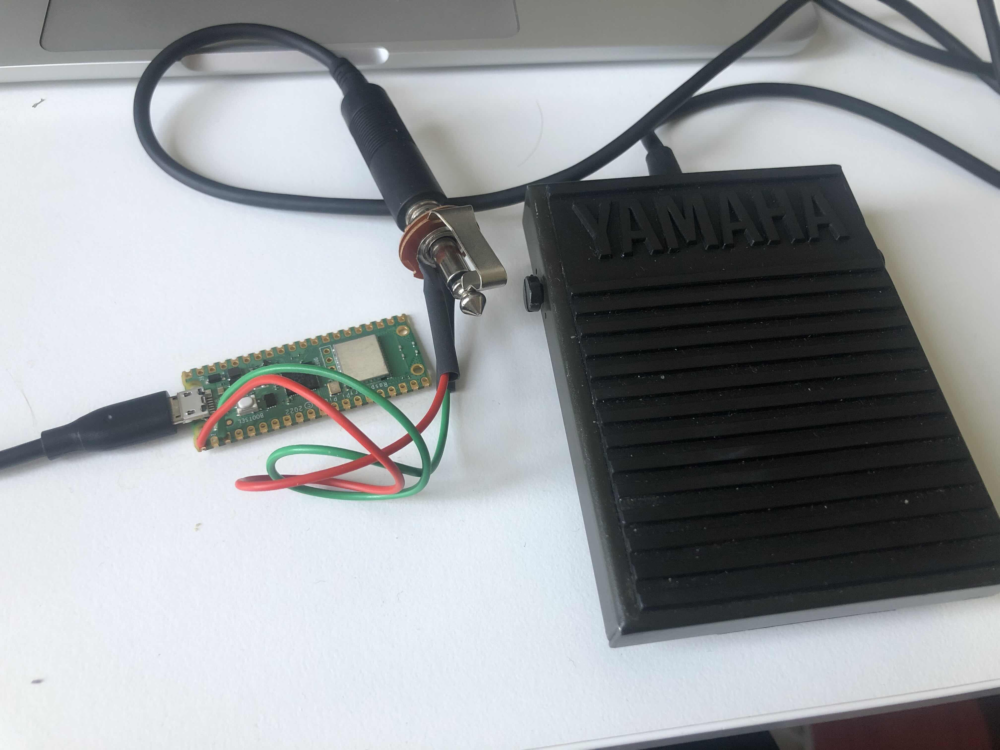

[](https://github.com/madskjeldgaard/raspberry-pi-pico-usbmidi-platformio-template/actions/workflows/build.yml)

# Sustain2Midi

 

This project is a simple Sustain pedal to midi note converter based on a raspberry pi pico board.

## Features

- Dirt cheap (all you need is a mono jack socket and a raspberry pi pico)
- Sends note on/off
- Note number can be changed easily by sending a midi note to the device.

## Dependencies

You need to have platformio installed to make use of this. I prefer using the command line version.

Install it on MacOS by running homebrew:

```bash
brew install platformio
```

## Compiling and uploading

To compile and upload your sketch, simply run the following command:

```bash
pio run -t upload
```
